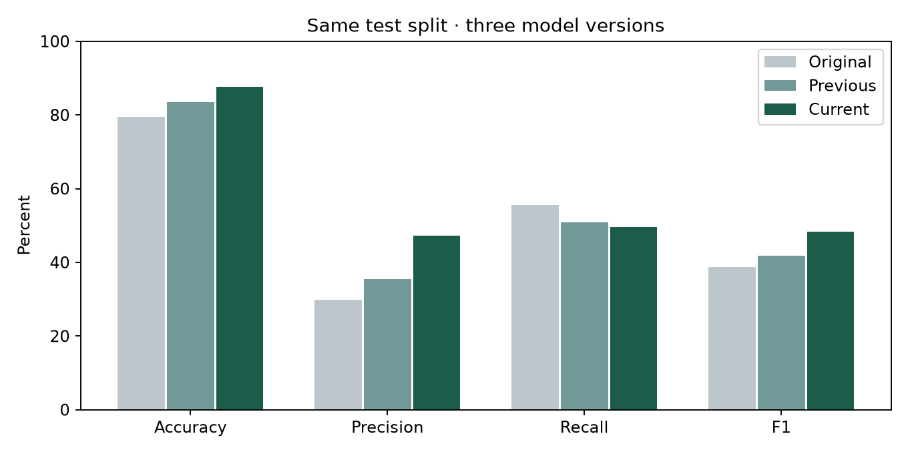

# Bank Subscription Predictor — Bank Marketing Decision Tree

New to Python, GitHub, or Vercel? Start with the [beginner's setup and deployment guide](BEGINNER_GUIDE.md).

The browser demo has four pages: **Predictor**, **Performance**, **Model**, and **About**. Header navigation connects them, with a comparison shortcut beside the predictor introduction.

- Performance compares the original baseline tree with the tuned tree using actual metrics, percentage-point changes, and confusion matrices on the same test split.
- Model insights compares top-five impurity importances and explains SHAP, class imbalance, preprocessing, and limitations.
- About introduces the project, its public dataset, and the author's GitHub profile.

`web/baseline.json` preserves the original committed model's importance ranking and baseline evaluation. Current results load from `web/model.json`, so retraining updates the tuned charts automatically. The bank illustration is a local SVG asset.

An additional training-only study of 12 recall-focused tree configurations is reproducible with `python -u explore_targets.py`. None achieved 90% accuracy together with improved recall; the current model remains selected. Results and limitations are in `outputs/target_study/findings.md`.

B.Y.T.E Data Science **Task 4**. A single decision-tree classifier with SHAP explanations, an executed notebook, evaluation charts, and a browser demo.

[Public repository](https://github.com/jarrodfranktamargocics-ui/DS_4_DecisionTreeClassifier_byte). Deployment instructions are below.

## Dataset and prediction timing

[UCI Bank Marketing](https://archive.ics.uci.edu/dataset/222/bank+marketing), Moro, Rita & Cortez (2014), [DOI 10.24432/C5K306](https://doi.org/10.24432/C5K306), CC BY 4.0. Use bank-full.csv: 45,211 rows, 16 original inputs, target y=yes/no for term-deposit subscription. Balances are euros.

The model predicts before a call. Exclude duration, which is unavailable then. Scheduled contact day/month and campaign contact count must be known. Keep unknown categories and pdays=-1; derive previously_contacted from pdays. One-hot encoding is fitted inside each training fold; numeric fields pass through. Dataset download and checksum are recorded by the training code.

## Results

| Metric | Original | Previous revision | Current |
|---|---:|---:|---:|
| Accuracy | 79.44% | 83.40% | 87.61% |
| Precision | 29.74% | 35.42% | 47.21% |
| Recall | 55.58% | 50.85% | 49.62% |
| F1 | 38.75% | 41.75% | 48.39% |

Test set: 9,043 rows; TN 7,398, FP 587, FN 533, TP 525. Compared with the previous revision: **394 fewer false positives, 13 more missed subscribers**. Always predicting no achieves 88.30% accuracy with zero subscriber recall. Current AP is 0.4101 and ROC-AUC is 0.7829.




## Experiment design

Keep the same 80/20 stratified split, seed 42. experiment.py never evaluates the test partition. It compares 55 candidates: seven prior-setting variants plus 48 seeded random configurations spanning depths 6/8/10/12, leaf caps 32/64/128, minimum leaf sizes 20/50/100, pruning alpha 0/.0001/.0005/.001, Gini/entropy, and no/balanced/2x/4x positive weights.

For each candidate, five validation folds (seed 2026) measure F1. Inside each validation-training partition, three inner folds generate out-of-fold scores to tune its cutoff. Refit on that partition and score on the separate validation fold. Fixed-cutoff comparisons use 0.5. Choose highest mean validation F1, ties preferring fewer leaves. These means are selection scores, not unbiased final estimates; historically selected configurations were already explored on the training pool.

Winner: entropy, maximum depth 12, leaf cap 128, minimum leaf size 20, class weights {0:1, 1:4}, pruning alpha 0.0005. Pruning leaves **57 leaves**. Mean validation F1: **47.36%**, compared with **41.59%** for the previous configuration under the same procedure. Several expanded settings scored similarly; this does not establish a uniquely superior configuration.

Freeze the winner, tune its final cutoff using three out-of-fold partitions of all training data (seed 314), then fit on all training data. Final cutoff: **0.579185520361991**; scores equal to the cutoff predict subscription. Test outcomes do not select the winner or cutoff. The test partition was already inspected for earlier versions, so its results are a same-split regression comparison. New external/prospective data is needed for an independent final assessment.

The comparisons show that tuning did not help the original small tree, the larger Gini tree was stronger, entropy did not clearly help the previous configuration, and removing its derived indicator produced identical validation scores. See [experiment findings](outputs/experiment/findings.md), [all candidate results](outputs/experiment/candidate_results.csv), [per-fold results](outputs/experiment/fold_results.csv), and [locked selection](outputs/experiment/selection.json).

## Local code and model files

- train.py: validates the selected model and exports predictions, SHAP, metrics, and charts. By default it reruns the experiment first.
- experiment.py: full search, comparisons, inner-fold cutoff tuning and selection.
- notebooks/bank_marketing.ipynb: executed notebook with both source files embedded.
- outputs/trained_pipeline.joblib: fitted Python preprocessing/model pipeline and cutoff.
- predict.py: load the saved model and predict from raw inputs.
- web/model.json: fitted tree, encoding schema, cutoff and evaluation for the browser.
- web/engine.js: browser inference and exact SHAP calculations.

The notebook explicitly reuses the saved training-only selection to avoid repeating the expensive search. It verifies dataset and split fingerprints, reloads the fitted pipeline, and recomputes evaluation and exports. Run train() without reuse_selection to repeat the full search. Joblib uses pickle: only load trusted model files.

## Run

Use Python 3.12 and Node.js 18+ from the repository root:

```sh
python -m venv .venv
# Windows: .venv\Scripts\activate
# macOS/Linux: source .venv/bin/activate
python -m pip install -r requirements.txt
python train.py
python make_notebook.py
node tests/model.test.mjs
python predict.py --example
python -m http.server 8000 --directory web
```

Open http://localhost:8000. The committed model.json lets the demo run without retraining. For a custom profile: python predict.py --input profile.json. Supply the 15 raw form fields; the contact indicator is derived automatically. Use the saved cutoff with predict_proba(); pipeline.predict() would use scikit-learn's default decision rule.

## Explanations and limitations

SHAP TreeExplainer uses tree_path_dependent perturbation and raw class-1 scores. Baseline plus contributions equals the score. Browser explanations sum exact leaf games; polynomial coefficients sum coalition products by size, avoiding exponential subset enumeration for deeper trees. Repeated features on a path are combined. Contributions are aggregated by original field, with the derived indicator separately labeled.

Tests compare **157 profiles** (100 test profiles plus representatives of all 57 test-reached leaves) against Python probabilities, labels and complete SHAP vectors. They also verify additivity, cutoff equality, invalid inputs and derived-feature consistency. The notebook verifies the saved pipeline reload.

These class-weighted scores are not calibrated purchase probabilities. SHAP describes model associations, not causes; correlated inputs can share attribution. Historical Portuguese campaigns do not establish current or future performance, and fairness has not been audited.

## Deployment and internship deliverables

The public repository name is DS_4_DecisionTreeClassifier_byte. On Vercel, import it with framework Other, output directory web, no build/install command; vercel.json supplies these settings. Only web assets are deployed; predictions run locally in the browser.

Required artifacts: [notebook](notebooks/bank_marketing.ipynb), [metrics](outputs/metrics.json), [confusion matrix](outputs/confusion_matrix.png), [feature ranking](outputs/feature_importance.png), and [model summary](outputs/model_summary.md). After deployment, add the live URL and write the LinkedIn progress post tagging B.Y.T.E by Arithmatrix; no post has been sent.

References: [scikit-learn threshold tuning](https://scikit-learn.org/stable/modules/classification_threshold.html), [SHAP TreeExplainer](https://shap.readthedocs.io/en/latest/generated/shap.TreeExplainer.html).
