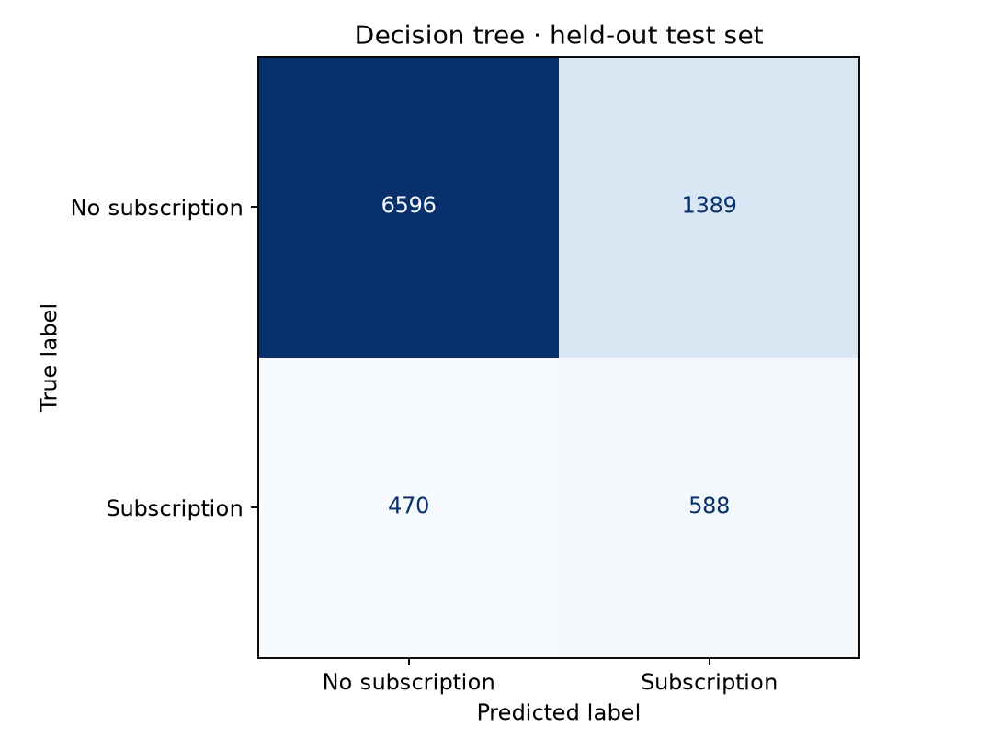
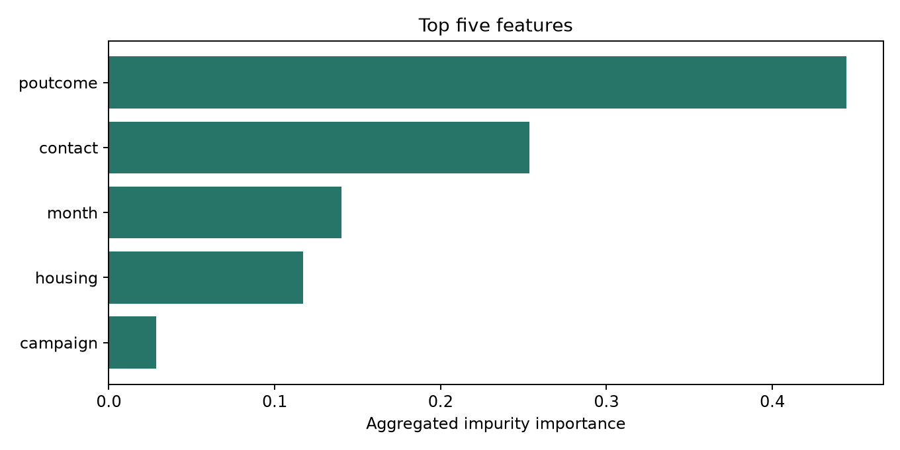

# Mind Reader — Bank Marketing Decision Tree

B.Y.T.E Data Science **Task 4**. A reproducible decision-tree classifier with individual SHAP explanations and an interactive, browser-only demo.

Public repository name: **DS_4_DecisionTreeClassifier_byte**. GitHub publication and the Vercel URL are pending account setup.

## Dataset

[UCI Bank Marketing](https://archive.ics.uci.edu/dataset/222/bank+marketing) — Moro, S., Rita, P., & Cortez, P. (2014). DOI: [10.24432/C5K306](https://doi.org/10.24432/C5K306). Licensed under **CC BY 4.0**.

Use `bank-full.csv`: 45,211 records, 16 original predictors, `y=yes/no` indicating term-deposit subscription. Balance is in euros. `train.py` downloads the official archive automatically. Dataset records are excluded from Git; the notebook documents the source and exported model summary records the CSV checksum.

## Run locally

Use Python 3.12 and Node.js 18 or later. In the repository root:

```sh
python -m venv .venv
# Windows: .venv\Scripts\activate
# macOS/Linux: source .venv/bin/activate
python -m pip install -r requirements.txt
python train.py
python make_notebook.py
node tests/model.test.mjs
python -m http.server 8000 --directory web
```

Open http://localhost:8000. The committed `web/model.json` lets the demo run without retraining. Open the executed notebook in Jupyter, VS Code, or GitHub. `make_notebook.py` embeds the full preprocessing and model code into the notebook and executes it.

## Method

- Exclude call duration, which is unavailable before the call. Predict for a planned campaign contact; scheduled day/month, contact number, and prior campaign history must be known.
- Preserve `unknown` categories and `pdays=-1` (no previous contact). Validate source schema and missingness.
- Stratified 80/20 train/test split with seed 42. One-hot encoding is fitted inside the pipeline, independently in each training fold. Trees need no numeric scaling.
- Five-fold stratified CV selects depth 3/4/5, minimum leaf size 50/150, and class weighting by F1. Maximum 8 leaves keeps the model small enough for exact browser explanations. No test-set tuning.
- Report accuracy, positive-class precision and recall, F1, confusion matrix, and top five original features ranked by aggregated impurity importance.

## Test-set results

| Metric | Result |
|---|---:|
| Accuracy | 79.44% |
| Precision | 29.74% |
| Recall | 55.58% |
| F1 | 38.75% |
| Always-no baseline accuracy | 88.30% |

9,043 held-out records: TN 6,596; FP 1,389; FN 470; TP 588. The selected balanced tree catches subscribers at the cost of more false positives. Its lower accuracy than the majority baseline is disclosed rather than hidden. These are educational results with meaningful room for improvement.




## How explanations work

Python uses `shap.TreeExplainer` with `tree_path_dependent` perturbation and raw class-1 scores. SHAP contributions plus the baseline equal the model score. The website exports the actual fitted tree and enumerates exact Shapley coalitions over its active one-hot split features, then sums contributions by original feature. At most seven split features means at most 128 coalitions.

`tests/model.test.mjs` compares 100 held-out browser predictions and full SHAP vectors to Python within numerical tolerance, verifies additivity, and rejects invalid inputs. Explanatory sentences are generated from signed SHAP contributions. Decision-path thresholds are also available in the demo. There are no hardcoded buy/no-buy rules.

Class-weighted scores are **not calibrated purchase probabilities**. Explanations describe model associations, not causes. The historical Portuguese dataset, random split, and unaudited fairness limit real-world use. See [model summary](outputs/model_summary.md).

## Deliverables

- [Executed notebook with full code](notebooks/bank_marketing.ipynb)
- [Training and export script](train.py)
- [Evaluation metrics](outputs/metrics.json)
- [Confusion matrix image](outputs/confusion_matrix.png)
- [Brief model summary](outputs/model_summary.md)
- `web/`: interactive demo, actual fitted tree, and exact explanation engine

## Publish on GitHub and Vercel

1. Create the public GitHub repository `DS_4_DecisionTreeClassifier_byte` and push this repository. Do not upload `.venv`, raw data, or credentials.
2. In Vercel, import the GitHub repository. Use framework **Other**, output directory **web**, and no build or install command. `vercel.json` supplies this configuration.
3. Deploy and add the live URL to this README and the GitHub repository's About section.
4. After deployment, write your LinkedIn progress post with the verified live/repository links, explain the class-imbalance and leakage challenges, and tag B.Y.T.E by Arithmatrix. Posting remains a separate user action.

Only static public artifacts are deployed. Customer form values are evaluated locally in the browser and are not sent to a prediction API.
